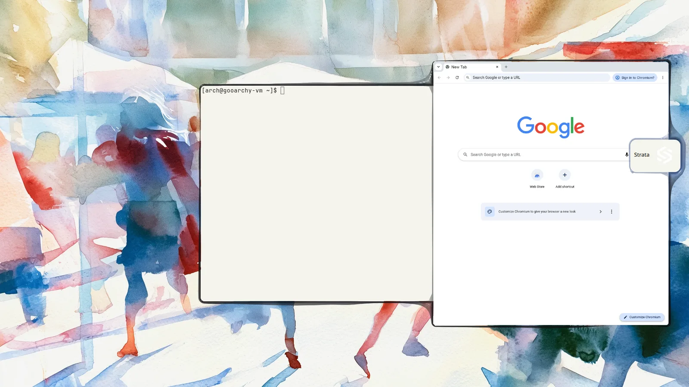

# Gooarchy

Pronounced "goo-ah-shee".

Gooarchy is a desktop Linux distribution built around [Scottland](https://github.com/clickety-clacks/scottland),
a spatial desktop on [Wayfire](https://wayfire.org/): no workspaces, windows scale down toward the
screen's edges, and a window dropped on a side rail becomes a widget. Gooarchy is patterned after
[Omarchy](https://omarchy.org/) (installer structure, package lists, update tooling) but starts
clean on plain Arch Linux. Nothing is borrowed to fill a gap: Gooarchy has no bar yet, so it has no
bar. Everything missing is listed in [DEFICIT.md](DEFICIT.md), found by using the built system.



## Current state: pre-alpha

The install script is prepared to consume Gooarchy's signed package repository. Its address and key
are still placeholders while hosting and key custody are undecided, so it stops before installing or
upgrading packages until they are configured. There is no public package repository, installer ISO
or update channel, and no hardware support beyond what Arch and Mesa give. It is for trying the
desktop and for building the distro, not for daily use.

What you get:

| | |
|---|---|
| Desktop | Scottland on Wayfire 0.11, built from Scottland's repository as the `scottland` package |
| Session | log in on tty1 and Scottland starts (no display manager); `--autologin` skips the password |
| Keyboard | the layout the system was installed with (Scottland's own default is `us`) |
| Terminal | Ghostty (Super+Enter) |
| Browser | Chromium (Super+Shift+B), with "Use system title bar and borders" on |
| Files | Strata (Super+Shift+F), the folder handler, from its AUR package |
| Theme | Watercolor Dream, light to start with; `gooarchy-theme dark` switches Scottland's halos, Ghostty, GTK apps and the wallpaper (Strata keeps its own theme for now). Scottland's Sunlight schedule is on by default: once it knows the location (GeoClue, saved coordinates, or an IP lookup to a public service) it switches light/dark with the sun every few seconds, also over a mode you picked. Turn it off in Scottland Settings (Super+comma) > Sunlight to keep one mode |
| Audio | PipeWire with WirePlumber; the volume keys work, with no on-screen indicator |
| Defaults | tmux titles read "session on host", mosh adds no title prefix, touchpad tap and tap-and-drag on, Print saves into your Pictures folder, Claude Code and Codex set to ring the terminal bell (Scottland shows a bell as attention) |

## Trying it

### In a VM (recommended)

`tests/vm/run.sh` boots the official Arch Linux cloud image under QEMU/KVM, runs the installer in it
unattended, reboots into Scottland and checks the desktop, saving screenshots, logs and a manifest
of the run. Run it on a spare or test machine, not one you're using.

You need an x86_64 Linux machine with KVM (`/dev/kvm`), QEMU with its virtio-gpu modules, python3,
OpenSSH (`ssh`, `ssh-keygen`), curl, git and tar. The default graphics (virgl) also need a usable GPU
render node (`/dev/dri/renderD*`); without one, set `GOOARCHY_VM_GPU=software`. On an Arch-based
machine without QEMU or root, `tests/vm/fetch-qemu.sh` unpacks a private copy first.

```sh
git clone https://github.com/clickety-clacks/gooarchy.git
cd gooarchy
tests/vm/run.sh            # everything; exits 1 if a check failed. Results: ~/.cache/gooarchy-vm-test/artifacts/<time>/
tests/vm/run.sh start      # boot the installed disk again afterwards (the run stops the VM)
tests/vm/run.sh ssh        # a shell in the guest
tests/vm/run.sh stop
```

To see the desktop, start the disk with software graphics and VNC, and point a VNC viewer at
port 5900 on that machine (from elsewhere: `ssh -L 5900:127.0.0.1:5900 <test machine>`):

```sh
GOOARCHY_VM_GPU=software GOOARCHY_VM_VNC=1 tests/vm/run.sh start
```

What the run does, in order: an install made to fail at one step and then rerun (it must recover);
rebuilding Scottland from another branch pin and returning to the fixed pin (the installed plugin
must follow); a reboot into the autologin session; the session check; password logins typed at the
consoles; and a check that a newer Wayfire can't install over the Scottland built for this one.

The session check drives the desktop the way a person would, through Wayfire's virtual input, and
checks each step against Scottland's own model and against the screen: Super+Enter opens Ghostty,
Super+Shift+F Strata and Super+Shift+B Chromium; the window dragged to the side scales down; the
window dragged to the edge becomes a widget card on the rail; a bell in an unfocused terminal becomes
Scottland attention; the volume and Print keys work; the system's keyboard layout reaches the
session; "show in folder" opens Strata; the portal's file chooser opens and cancels; Sunlight behaves
as described above; two logouts each close the old login completely; a crashed compositor leaves a
shell on tty1 instead of a restart loop. Checks named "config:" only read configuration (Chromium's
title bar setting, tmux, touchpad, the agents' bell settings); they don't show the behavior. It also
records what's missing (notifications, lock, portals, ...) for [DEFICIT.md](DEFICIT.md). On
2026-10-05, fresh runs passed every check with virgl graphics (65) and with software graphics (66,
including the login check restoring autologin). `tests/vm/selftest.py` checks the harness, and
`tests/flavorings-pkgbuild-source-test.sh` checks the
final-tag-only package source selector without a VM; the defaults tool's tests live in
gooarchy-flavorings.

What it doesn't show: it's the Arch cloud image (cloud-init gives it an SSH key and passwordless
sudo; the harness masks systemd's wait for network time and shares pacman's cache from the host),
not an archinstall minimal install; nothing is played or recorded through the sound card; and no
real hardware is involved. The default image is the latest one; to repeat a run exactly, use the
dated image and checksum from its `manifest.json` (`GOOARCHY_VM_IMAGE_URL`,
`GOOARCHY_VM_IMAGE_SHA256`). All settings are at the top of `tests/vm/run.sh`.

### On a machine

On a fresh Arch Linux install (archinstall's minimal profile is fine), as your user, with sudo:

```sh
sudo pacman -S --needed git
git clone https://github.com/clickety-clacks/gooarchy.git
cd gooarchy
./install.sh
```

Then reboot, or log in on tty1. Super+Enter opens a terminal; Super+Shift+Escape logs out. Read
[DEFICIT.md](DEFICIT.md) first: there is no lock screen, no network or Bluetooth UI, no
notifications and no bar. [docs/uninstall.md](docs/uninstall.md) explains how to remove it, and
how to back out of an install that failed partway (running `./install.sh` again retries it).

How logging in works: any ordinary account that logs in on tty1 from a bash or zsh login shell gets
Scottland. Root on tty1 gets a plain console, and so does every other console and every SSH login.
Creating `~/.config/gooarchy/no-session` keeps tty1 a console for that account. Other login shells
(fish, ...) don't read the profile script, so for them tty1 stays a console. With `--autologin`, tty1
logs your account in at boot without a password; logging out logs straight back in, and after a
crash tty1 is left at your logged-in shell. Running the installer again without `--autologin` keeps
an existing autologin setting; [docs/uninstall.md](docs/uninstall.md) says how to remove it.

Keeping it current: `pacman -Syu` updates Arch's packages as usual. When Arch updates Wayfire,
pacman stops ("wayfire=… required by scottland"), because the Scottland plugin is built for one
Wayfire version. Once a matching Scottland package is published, `pacman -Syu` updates it with
Wayfire. To deliberately build Scottland locally, set `GOOARCHY_SCOTTLAND_REF` when running
`./install.sh`. Overrides accept final version tags (`vMAJOR.MINOR.PATCH`) or branches; the
2026.11 test line uses the Scottland `0.3` branch and sets
`GOOARCHY_SCOTTLAND_REF_KIND=branch`. Raw commit overrides and release-candidate tags are rejected.
Main keeps the current fixed Scottland pin until v0.2.0 is final and keeps the current Flavorings
pin until the first reviewed-main final tag is cut; main then uses only those final tags.

### Gooarchy's defaults on stock Omarchy

Scottland's Omarchy adapter uses the same `gooarchy-flavorings` package. On an Omarchy machine,
without Gooarchy:

1. Build Scottland's packages (`scottland` and `scottland-omarchy`) from Scottland's
   `packaging/arch/PKGBUILD` with `makepkg`, without installing them yet.
2. Build `gooarchy-flavorings` from this repository's `packaging/gooarchy-flavorings/PKGBUILD`: copy
   it into an empty directory and run `makepkg --nodeps` there (`--nodeps` because Scottland, one of
   its runtime dependencies, isn't installed yet; building needs only git and Python).
3. Install all three together, in one `sudo pacman -U` with the three package files, so each finds
   the others.

## How it is put together

| Path | What |
|---|---|
| `install.sh`, `install/` | The installer, in ordered steps like Omarchy's: `preflight/` (checks), `packaging/` (Arch packages, then Scottland, Strata and Gooarchy's own packages), `user/` (per-user defaults), `login/` (tty1 session, optional autologin), `post-install/` |
| `install/gooarchy-base.packages` | The Arch packages Gooarchy is made of |
| `install/sources.conf` | Scottland and Strata, pinned to the versions tested together |
| `packaging/arch/PKGBUILD` | Builds `gooarchy` (the session start; depends on `gooarchy-flavorings`) from this checkout |
| `packaging/gooarchy-flavorings/PKGBUILD` | Builds `gooarchy-flavorings` from the separate repository at its final version tag; its combined theme variants install under `/usr/share/gooarchy-flavorings/themes/<name>/` |
| `session/` | The tty1 session start (`/etc/profile.d/gooarchy-session.sh`), its cleanup helper, and the config fragment that carries the system's keyboard layout into Scottland |
| `packaging/linux-gooarchy/` | Gooarchy's optional kernel package, built from Omarchy's pinned linux-omarchy sources. `./install.sh --kernel` installs it alongside the existing default kernel; messages-only VM acceptance and real-hardware validation are pending ([its README](packaging/linux-gooarchy/README.md)) |
| `tests/vm/` | The VM test (`run.sh`), its in-guest checks, and a self-test of its own machinery (`selftest.py`) |
| `tools/privacy-check.py` | Looks for developer-network details in the whole history (or `--tree`), with a deny list kept outside the repository |

Gooarchy's programs, hooks, themes and default configuration all come from packages. Outside
packages, the installer writes only configuration state: the optional autologin drop-in (a replaced
one is reported), and per-user defaults in your home directory that `gooarchy-flavorings-apply`
fills in once each, only where nothing is set. A setting you already have is left alone and
reported, a symlinked config file is not touched, and files it does change keep their
permissions. Build records and logs go to `~/.local/state/gooarchy`.

## Plan

In order:

1. **Standalone Scottland**: Scottland runs on plain Arch without Omarchy. Done for this install
   path; the Scottland changes it still needs are in DEFICIT.md.
2. **Install script**: a fresh Arch install becomes Gooarchy (this repository today).
3. **Package repository**: Gooarchy's own signed pacman repository with Gooarchy's packages,
   Scottland and the portal and kernel packages. Arch and AUR repositories keep supplying
   everything else, including Strata.
4. **Defaults**: gooarchy-flavorings as its own package, and Gooarchy's own bar, notifications,
   launcher, lock screen and the rest of the deficit.
5. **Hardware**: a supported hardware matrix with GPU, firmware, power and laptop quirks.
6. **ISO**: an installer image (partitioning, encryption, accounts) instead of "install Arch first".
7. **Updates**: an update command with migrations for user and system configuration.
8. **First run**: onboarding that respects Scottland's attention model.
9. **Releases**: versioned releases, release channels and support commitments.
